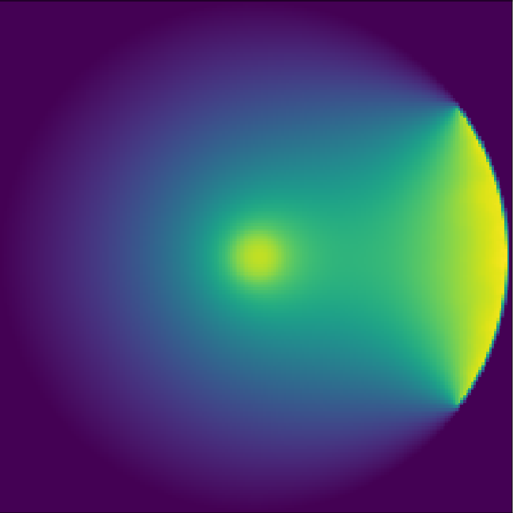
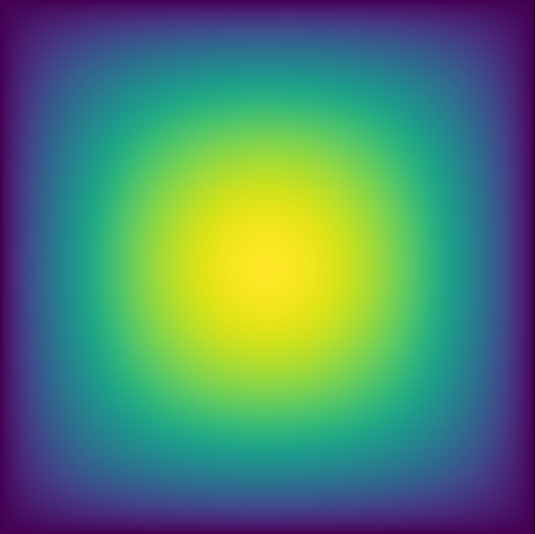

# ReverseWoS.jl
This package provides tools to solve linear elliptic PDEs with Dirichlet and Neumann boundary conditions using the Walk On Sphere "Reverse" algorithm from Qi et al. 2020

# Exemple
## General linear elliptic PDE

## Cold tank with uniform heat source


# Usage
We will for the example solve the most generic linear elliptic PDE, with both Dirichlet and Neumann boundary conditions :

$$\Delta u(x) = f(x) \quad \forall x\in \Omega$$
$$u(x) = g(x) \quad \forall x \in \partial \Omega _D$$
$$\frac{\partial u(x)}{\partial n}  = h(x) \quad \forall x\in \partial \Omega _N$$

```julia
using ReverseWoS
using CairoMakie

# Problem definition
f(x,y) = 20.
g(x,y) = 0.
h(x,y) = 0.4
Ω = ((-1,1),(-1,1))
∂Ω(x,y) = 1.0 - sqrt(x^2+y^2)
is∂Ωn(x,y) = x>0.8
function sample_s()
    ρ = 0.1 * sqrt(rand())
    θ = 2π * rand()
    (ρ*cos(θ),ρ*sin(θ)),1/(π*0.1^2)
end
function sample_b()
    θ = 2π*rand()
    (cos(θ),sin(θ)),1/(2π)
end

ngrid = 200
nwalks = 1e6
axs,u = ReverseWoS.SolveGPU(f,g,h,Ω,∂Ω,is∂Ωn,sample_s,sample_b,ngrid=ngrid,nwalks=nwalks)

ReverseWoS.plot2D(axs,u,figure=(;resolution=(700,700)))
```

# Bibliography
Qi, Yang, Dario Seyb, Benedikt Bitterli, et Wojciech Jarosz. « A Bidirectional Formulation for Walk on Spheres ». Computer Graphics Forum 41, nᵒ 4 (juillet 2022): 51‑62. https://doi.org/10.1111/cgf.14586.
